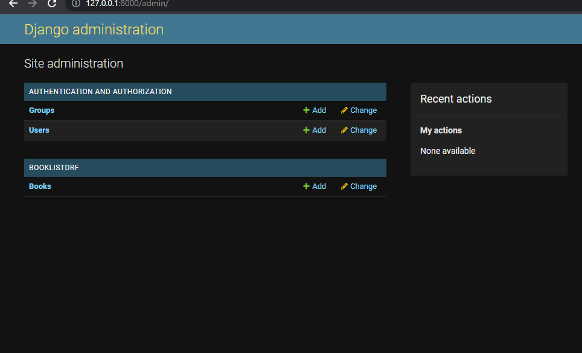

# Django-Rest-Framework
## Creating a simple BookListDRF app using Django-Rest-Framework
# Prerequisites
open cmd on windows and type the following commands respectively:

    mkdir Django-Rest-Framework && cd Django-Rest-Framework
    
    pip install pipenv

    pipenv shell      # this command creates a virtual environment for the project
    
    pipenv install django     # install django framework in the virtual environment
    
    django-admin startproject BookList .       # creates a project
    
    python manage.py startapp BookListDRF       # initializes the app
    
    pipenv install djangorestframework
    
    code .      # opens the project in Visual Studio Code
    
refer to https://docs.djangoproject.com/en/4.1/intro/tutorial01/
    
### configurations
Open the settings.py and add to the list of to the installed apps 
        
        'rest_framework',
        'BookListDRF',

### Database setup¶
run the following command:

    python manage.py migrate

Read more https://docs.djangoproject.com/en/4.1/intro/tutorial02/
### Views
#### class-based views
refer https://www.django-rest-framework.org/tutorial/3-class-based-views/
Open the file BookListDRF/views.py and put the following Python code in it:

### Pagination
Create a urls.py in the app's directory and add the following code:

modify BookList/urls.py to look like this:

### Creating models¶
Edit the BookListDRF/models.py file so it looks like this:

Here, each model is represented by a class that subclasses django.db.models.Model.

#### Activating models¶
    python manage.py makemigrations

    python manage.py migrate

### Serialization
read more https://www.django-rest-framework.org/tutorial/1-serialization/

create a file BookListDRF/serializers.py and add the following code:

### Introducing the Django Admin¶
Creating an admin user¶
First you’ll need to create a user who can login to the admin site. Run the following command:

    python manage.py createsuperuser

Enter your desired username and press enter.

    Username: admin

You will then be prompted for your desired email address:

    Email address: admin@example.com

The final step is to enter your password. You will be asked to enter your password twice, the second time as a confirmation of the first.

    Password: **********
    Password (again): *********
    Superuser created successfully.

now run:

    python manage.py runserver

navigate to:

    http://127.0.0.1:8000/admin/

#### Make the poll app modifiable in the admin¶
open the BookListDRF/admin.py file, and edit it to look like this:

Explore the free admin functionality¶

### Adding items 

Open http://127.0.0.1:8000/ and add the following:

    title = The Great Gatsby
    author = Francis Scott Fitzgerald
    price = 6.50
and post.

it should look like this:

### Testing
If you do not have Insomnia installed, you can download it from https://insomnia.rest/download

Open insomnia and create a new request which the HTTP GET method. Write the following URL in the URL field, http://127.0.0.1:8000. Now click the "Send button". You should see something like this:

#### References
1) https://www.django-rest-framework.org/tutorial/quickstart/

